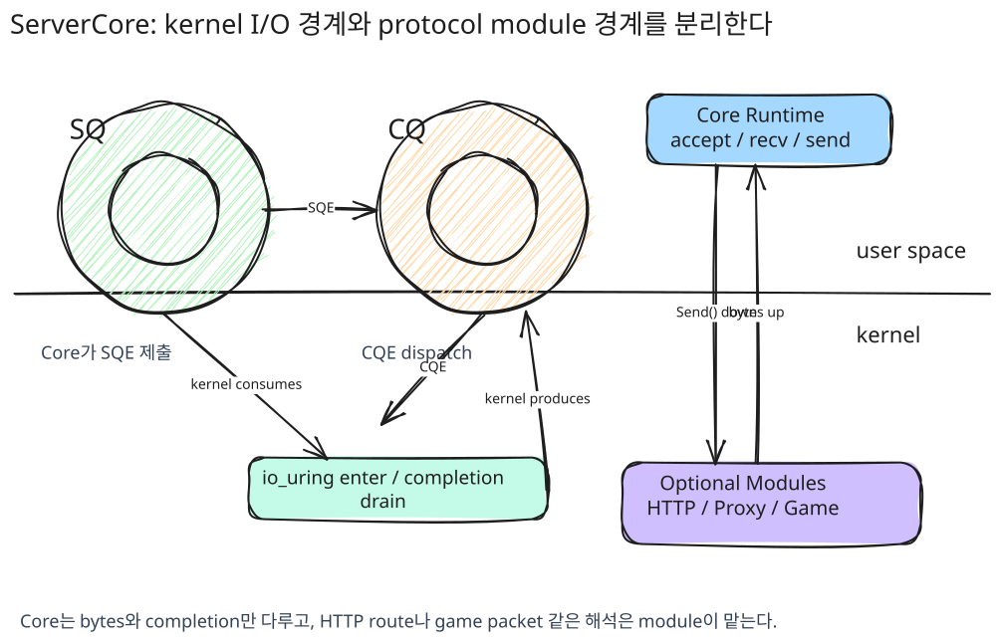
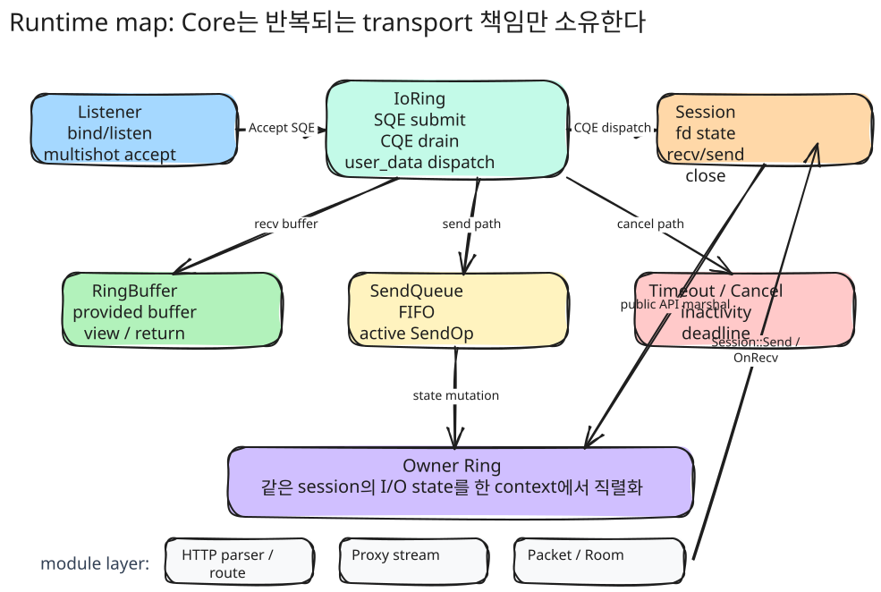
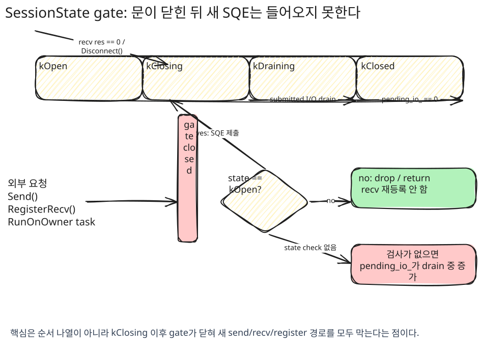
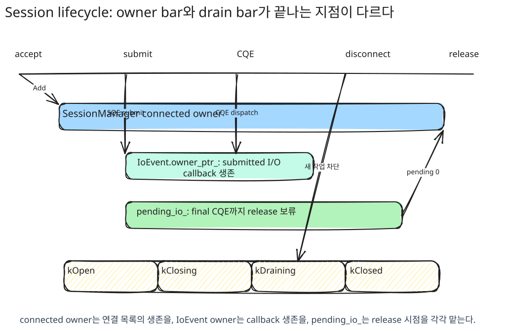
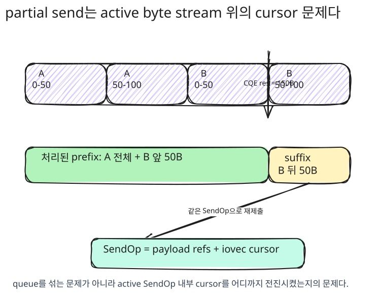
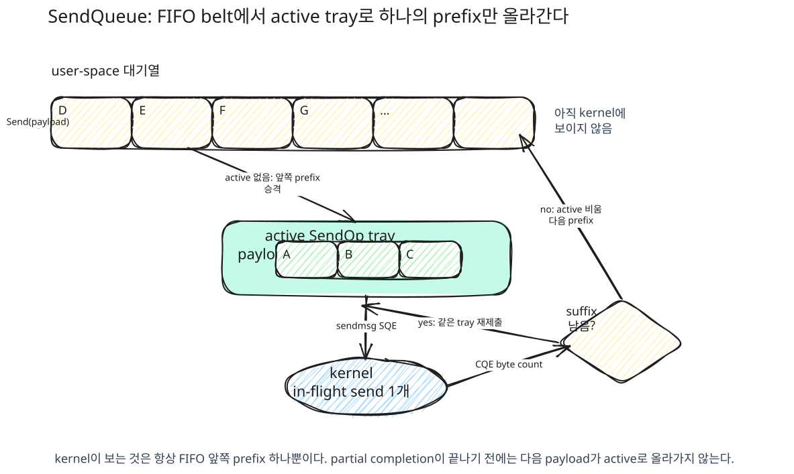
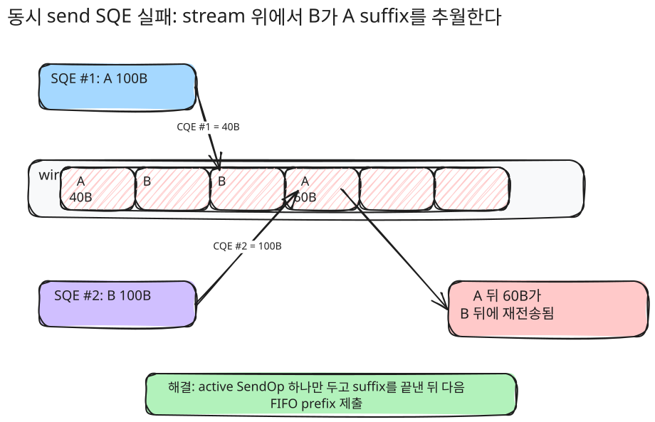
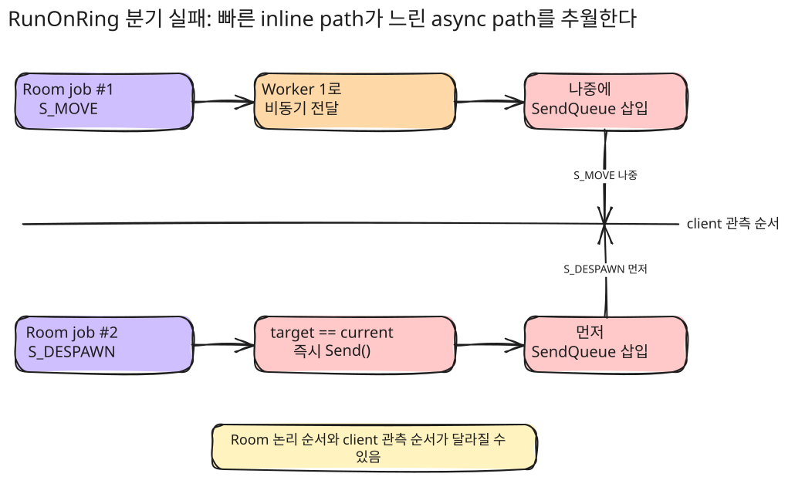
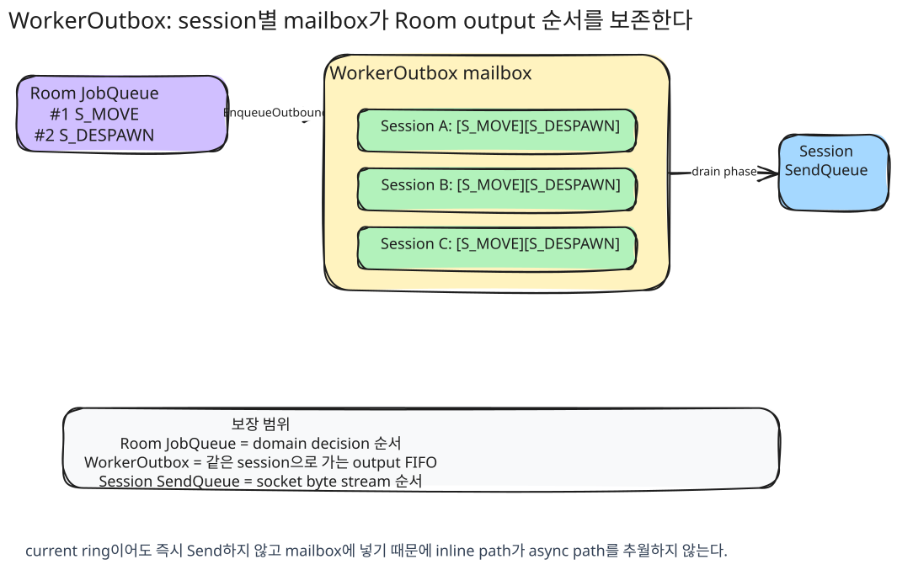

## 프로젝트 개요 {#sec-overview}

::: {.summary-grid}
::: {.summary-card}
**Runtime**

프로토콜과 분리된 io_uring 전송 런타임
:::

::: {.summary-card}
**I/O**

Multishot Accept/Recv, Provided Buffer, MSG_RING 기반 처리
:::

::: {.summary-card}
**Lifecycle**

SessionManager, IoEvent owner, pending_io_로 비동기 수명 경계 관리
:::

::: {.summary-card}
**Modules**

RuntimeWeb, RuntimeProxy, RuntimeGame을 같은 Core 위에 분리
:::
:::


### 무엇을 만들었나

ServerCore는 Linux `io_uring`을 기반으로 만든 프로토콜 독립 서버 런타임입니다. 목표는 특정 게임 서버 하나를 빠르게 만드는 것이 아니라, TCP 연결 수락, 수신/송신, 시간 초과/취소, 버퍼 소유권, 세션 수명주기, 스레드 간 작업 전달을 공통 중심으로 분리하는 것이었습니다.

Core는 바이트를 받고 보내며 완료 통지를 처리합니다. 그 바이트가 HTTP 요청인지, 프록시 스트림인지, 게임 패킷인지는 Core가 해석하지 않습니다. HTTP, Proxy, Game은 Core 위의 선택 모듈로 분리하고, 각 모듈은 자신에게 필요한 파서, 라우팅, 패킷 프레이밍, Room 실행 모델만 추가합니다.

### 왜 직접 만들었나

처음에는 TCP/Protobuf 기반 게임 서버의 연결 수락, 수신, 송신, 연결 종료 흐름을 직접 구현하는 문제로 시작했습니다. 하지만 기능을 늘릴수록 어려운 부분은 프로토콜 처리기가 아니라, 늦게 도착하는 완료 통지, 부분 송신, 버퍼 수명, 연결 종료 중 새 작업 차단, 여러 워커가 같은 세션을 건드리는 경계였습니다.

기존 epoll 모델에서는 준비 상태를 받은 뒤에도 별도의 `read`/`write` 시스템콜을 호출해야 하고, 각 서버가 같은 수명관리와 버퍼 규칙을 반복해서 구현하기 쉽습니다. 반면 `io_uring`은 제출 큐와 완료 큐를 커널과 공유 메모리로 매핑하고, 다중 완료 연결 수락/수신과 제공 버퍼를 활용해 제출과 완료의 경계를 더 명확하게 다룰 수 있습니다. 이 특성을 앱 하나에 묶어두지 않고, 재사용 가능한 전송 런타임으로 확장하는 것이 이 문서의 핵심입니다.

{width="82%"}

### 사용한 io_uring 기능

`IoRing` 클래스는 `io_uring` 인스턴스를 RAII로 관리하며, 현재 스레드의 ring을 통해 SQE 제출과 CQE 처리를 수행합니다.

- **Multishot Accept** - 하나의 SQE로 여러 연결을 수락합니다. 새 연결마다 CQE만 추가로 발생하므로 연결 수락 재제출 비용을 줄일 수 있습니다.
- **Multishot Recv + Provided Buffer** - `IOSQE_BUFFER_SELECT` 플래그로 커널이 제공 버퍼 ring에서 버퍼를 선택하게 합니다. 수신 경로의 버퍼 관리 비용과 불필요한 복사를 줄입니다.
- **MSG_RING** - `IORING_OP_MSG_RING`으로 다른 워커 ring에 작업을 전달합니다. 세션 소유자 실행 문맥으로 작업을 모으는 기반으로 사용했습니다.

***

## Runtime 설계와 실행 모델 {#sec-runtime-model}

### 전체 구조

구현된 전체 코드는 `io_uring` 기반 TCP 비동기 I/O 처리와 그 수명주기를 관리하는 런타임입니다. 각 소켓을 세션 단위로 감싸고, 버퍼, 동시성, 수명주기를 Core에서 관리합니다. 프로토콜 해석과 애플리케이션 정책은 상위 모듈로 분리해 책임을 나누었습니다.

Core 주요 클래스

| Core             | 설명                                                  |
| ---------------- | --------------------------------------------------- |
| Listener         | 소켓 bind/listen, 다중 완료 연결 수락, 연결 분산 |
| Session          | fd 상태, 수신/송신 흐름, 닫힘 상태 전환                    |
| IoRing           | SQE 제출, CQE 비우기, `user_data` 기반 처리                  |
| RingBuffer       | 제공 버퍼 관리, 뷰 생성, 반환 정책                           |
| SendQueue        | 대기 중인 송신 관리, 부분 송신 재시도, watermark                  |
| Timeout / Cancel | 비활성 시간, deadline, 취소 요청                     |
| Owner Ring       | 세션 I/O 상태 직렬화                                      |

{width="82%"}

초기 구현은 연결 수락, 수신, 송신, 연결 종료 흐름을 직접 구현하는 방식이었습니다. 시작점은 TCP/Protobuf 기반 게임 서버였기 때문에 전송 I/O, 패킷 처리, 게임 로직이 한 계층에서 섞이기 쉬웠습니다.

기능을 추가할수록 HTTP, Proxy, Game은 서로 다른 서버처럼 보이지만, 실제로는 TCP 연결 수락, 수신/송신, 연결 종료, 시간 초과, 취소, 버퍼 소유권, 세션 수명주기 같은 계층의 I/O 문제를 반복해서 공유하고 있었습니다. 이 부분을 각 서버마다 다시 구현하면 결국 재사용하기 어려운 단일 게임 서버에 머물 수밖에 없다고 생각했습니다.

최종 구현에서 Core는 연결 수락, 송수신, 시간 초과/취소, 버퍼 소유권, 세션 수명주기처럼 모든 서버가 공유하는 I/O 책임만 담당합니다.

Core는 바이트를 받고 보내며 완료 통지를 처리하지만, 그 바이트가 HTTP인지 게임 패킷인지 프록시 스트림인지는 해석하지 않습니다. Web 요청도 Core 세션을 거쳐 `HttpSession::OnRecv()`로 올라가고, 파싱/라우팅/핸들러는 Web 모듈이 처리한 뒤 응답은 다시 `Session::Send()`로 내려갑니다.

`HttpSession`과 `PacketSession`은 모두 Core `Session`을 직접 상속하고, 차이는 스트림을 메시지 단위로 해석하는 방식입니다. `PacketSession`은 `[size][id][payload]` 헤더를 읽어 패킷 경계를 판단하고, `HttpSession`은 HTTP/1.1 파서 상태를 유지하면서 헤더 종료, `Content-Length`, chunked 본문, 파이프라이닝을 처리합니다.

***

## 수명관리 {#sec-session-lifecycle}

세션 수명관리 지점에서 `Session` 객체가 "살아 있다"는 뜻이 연결 목록에 남아 있는지, 이미 제출된 I/O의 완료 통지가 아직 돌아올 수 있는지, CQE 콜백을 실행하는 동안 이벤트 객체를 유지해야 하는지는 서로 다른 판단을 해야했습니다.

이 판단을 세 갈래로 분리했습니다.

| 장치               | 판단 범위                | 결정하는 것                                   | 결정하지 않는 것                   |
| ---------------- | -------------------- | ---------------------------------------- | --------------------------- |
| `DispatchResult` | 이번 CQE와 해당 `IoEvent` | CQE 처리 뒤 `IoEvent`를 완료/유지/재사용할지          | 세션을 관리자에서 해제해도 되는지 |
| `pending_io_`    | 세션 전체의 제출된 I/O | 이미 제출된 세션 I/O가 모두 CQE를 받았는지         | 새 작업을 받아도 되는 상태인지           |
| `SessionState`   | 세션의 논리적 상태           | 열림/종료 중/비우는 중/닫힘 상태와 새 작업 차단 | 이벤트 객체 삭제 여부나 I/O 개수      |

***

### `SessionManager`: 애플리케이션 단위의 소유 단위

`SessionManager`는 세션이 외부에서 살아 있는 세션으로 취급되는 동안의 장기 소유자입니다. 연결 수락 직후의 지역 `shared_ptr`는 연결 수락 처리 범위가 끝나면 사라지므로, 연결 단위 작업을 이어가려면 관리자 소유권이 필요합니다.

```cpp
auto self = std::static_pointer_cast<Session>(shared_from_this());
ring_.Sessions().Add(self);
OnConnected();
RegisterRecv();
```

관리자에 등록된 세션은 애플리케이션에서 조회될 수 있고, 수신/송신/연결 종료 같은 연결 단위 작업의 기준점이 됩니다.

***

### `IoEvent.owner_ptr_`의 역할

원시 `Session*`만 CQE에 싣는 구조에서는 관리자에서 세션이 제거된 뒤 늦은 CQE가 도착하면 해제 후 사용 문제가 생깁니다. 따라서 CQE의 `user_data`에는 콜백 대상인 `Session*` 자체가 아니라, 제출된 I/O의 상태와 수명을 대표하는 `IoEvent*`를 싣습니다.

`IoEvent`는 해당 작업이 완료될 때까지 살아 있어야 하고, 내부의 `owner_ptr_`가 `Session`을 `shared_ptr`로 붙잡습니다. CQE가 도착하면 `IoRing`은 `user_data`에서 `IoEvent*`를 꺼내고, `ev->Owner()`로 `shared_ptr`을 하나 복사해 콜백 동안 `Session` 생존을 보장한 뒤 `owner->Dispatch(ev, result, flags)`를 호출합니다.

이 구조에서 관리자는 "연결된 세션 목록"의 소유자일 뿐, 이미 커널에 제출된 I/O의 완료 시점까지 `Session` 생존을 단독으로 보장하지 않습니다. 제출된 I/O의 생존 보장은 `IoEvent.owner_ptr_`가 담당하고, `IoEvent` 자체의 삭제 시점은 `DispatchResult`가 결정합니다. 다중 완료 수신/연결 수락은 `IORING_CQE_F_MORE`가 있는 동안 `kPending`으로 유지되고, 부분 송신처럼 같은 이벤트를 재제출한 경우 `kRearmed`로 유지됩니다.

***

### `DispatchResult`: 이번 CQE 후 이벤트를 어떻게 할지

이전 구조에서는 이벤트 내부의 `RetainAfterDispatch()` 같은 플래그가 처리 이후 이벤트 정리 여부를 간접적으로 결정했습니다. 지금은 콜백이 이번 CQE 이후의 이벤트 상태를 명시적으로 반환합니다.

```cpp
enum class DispatchResult {
    kComplete,
    kPending,
    kRearmed,
};
```

| 값 | 의미 | 대표 상황 |
| --- | --- | --- |
| `kComplete` | 이번 CQE로 이 이벤트의 제출 상태가 끝남 | 단일 수신/송신/연결 종료 완료, 다중 완료 작업의 최종 CQE |
| `kPending` | 같은 제출에서 CQE가 더 올 수 있음 | `IORING_CQE_F_MORE`가 있는 다중 완료 수신/연결 수락 중간 CQE |
| `kRearmed` | 같은 이벤트 객체로 새 SQE를 재제출함 | 부분 송신에서 남은 바이트를 같은 `send_op_`로 재제출 |

***

### `Session::pending_io_`: 세션 해제 가능성 판단

`pending_io_`는 이 세션에서 이미 제출된 I/O 중 아직 CQE를 받지 않은 것이 남아 있는지를 판단합니다.

기본 규칙은 SQE 제출에 성공하면 `BeginPendingIo()`로 세션에 걸린 제출 I/O를 하나 늘리고, 해당 제출이 끝나는 CQE가 도착하면 `CompletePendingIo()`로 줄입니다.

여기서 "끝나는 CQE"는 단일 I/O의 완료 통지, 다중 완료 I/O의 최종 CQE, 실패나 취소 결과처럼 더 이상 같은 제출에서 완료 통지가 오지 않는 CQE를 말합니다. `IORING_CQE_F_MORE` 가 붙은 수신 중간 CQE는 아직 같은 수신 SQE가 살아 있으므로 `pending_io_`를 감소시키지 않습니다.

	
`IoEvent.owner_ptr_`와 세션 관리자가 세션 객체 생존을 보장하더라도, `pending_io_`가 0이 되기 전에 `OnDisconnected()`와 관리자 해제를 실행하면 논리적 종료 순서가 깨집니다.

| 불일치 지점 | 문제가 되는 이유 |
| --- | --- |
| 앱 상태는 정리됐지만 늦은 수신 CQE가 남아 있음 | 이미 제거한 player/room 상태를 늦은 완료 경로가 다시 건드릴 수 있음 |
| 관리자 count는 줄었지만 진행 중인 I/O가 남아 있음 | 논리적 동시 세션 수와 커널에 걸린 작업 수가 어긋남 |
| fd는 닫혔지만 이전 CQE 로그가 남아 있음 | 같은 fd 번호가 새 연결에 재사용되면 이전/새 로그가 섞여 보임 |
| 연결 종료 CQE는 왔지만 다중 완료 수신의 최종 CQE가 아직 없음 | 연결 종료 완료만으로 수신 제출 상태가 끝났다고 볼 수 없음 |
| 취소 요청은 냈지만 취소 CQE가 아직 없음 | 취소 요청과 취소 완료는 분리되어 있어 결과가 아직 확정되지 않음 |

그래서 해제 조건은 `Disconnect()` 호출 여부가 아니라 "종료가 시작됐고, 더 이상 돌아올 세션 I/O가 없으며, 연결 종료 통지를 아직 보내지 않았다"가 되어야 합니다. 코드 기준으로는 `ClosingStarted() && pending_io_ == 0 && disconnected_notified_ == false`입니다.

#### 부분 송신과 `kRearmed`

`pending_io_`를 제출된 I/O 개수로 정의하면 부분 송신도 명확해집니다. 송신 SQE 제출 성공분은 `pending_io_`를 증가시키고, 짧은 쓰기 CQE는 기존 제출을 완료한 뒤 남은 바이트 재제출 성공분만 다시 증가시킵니다. 마지막 송신 CQE가 도착했을 때만 `DispatchResult::kComplete`로 정리됩니다.

송신의 부분 완료와 수신의 다중 완료 중간 CQE는 둘 다 이벤트 객체를 유지하지만, 유지하는 이유가 다릅니다.

| 경로                       | CQE 의미                                   | `DispatchResult` | `pending_io_`        |
| ------------------------ | ---------------------------------------- | ---------------- | -------------------- |
| 송신 완료                  | 단일 송신 SQE 종료                  | `kComplete`      | 감소                   |
| 송신 짧은 쓰기         | 기존 송신 SQE 종료 + 남은 바이트로 새 송신 SQE 재제출 | `kRearmed`       | 기존 제출 감소, 재제출 성공분 증가 |
| 다중 완료 수신 중간 CQE    | 같은 수신 SQE가 계속 살아 있음                    | `kPending`       | 유지                   |
| 다중 완료 수신 최종 CQE | 수신 SQE 종료                              | `kComplete`      | 감소                   |

`kPending`은 "같은 제출이 아직 살아 있어서 이벤트를 유지한다"는 뜻이고, `kRearmed`는 "기존 제출은 끝났지만 같은 이벤트 객체를 새 제출에 다시 걸었기 때문에 이벤트를 유지한다"는 뜻입니다.

***

### `SessionState`: 종료 의도와 새 작업 차단

`pending_io_`는 이미 제출된 I/O가 남았는지만 셉니다. 하지만 세션이 지금 새 작업을 받아도 되는지는 별도의 상태 판단입니다.

예전에는 이 구분을 `disconnecting_` 같은 bool 하나로 처리할 수 있어 보였습니다. 지금은 상태를 명시적으로 나누었습니다.

```cpp
enum class SessionState : std::uint8_t {
    kOpen,
    kClosing,
    kDraining,
    kClosed,
};

std::atomic<SessionState> state_;
```

| State | 의미 |
| --- | --- |
| `kOpen` | 정상 송수신 가능 |
| `kClosing` | 종료가 시작됨, 새 작업 차단 |
| `kDraining` | 종료 관련 작업을 제출했고 기존 CQE 비우기 대기 |
| `kClosed` | `OnDisconnected()`와 관리자 해제 완료 |
핵심은 `kOpen`이 아닌 순간부터 새 수신/송신/등록이 들어오면 안 된다는 것입니다.

{width="82%"}

`SessionState`가 없으면 수신 CQE에서 `res == 0`을 확인해 `Disconnect()`를 시작한 뒤에도 다른 경로의 `Send()`나 `RegisterRecv()`가 새 SQE를 만들 수 있습니다. 이 경우 비우는 중인 세션의 `pending_io_`가 다시 증가하거나, 종료 중인 세션에 수신이 다시 걸려 해제 조건이 흔들립니다.

따라서 `SessionState`의 역할은 세션을 직접 살리는 것이 아닙니다. 종료 의도를 기록하고, 종료가 시작된 뒤 새 작업이 들어오지 못하게 문을 닫는 것입니다. 정리하면 `SessionState`는 새 작업 허용 여부, 종료 시작 여부, `closed` 1회 처리 상태를 담당합니다.

***

### 전체 흐름

정상 연결 흐름은 다음과 같습니다.

{width="82%"}

종료 흐름은 다음과 같습니다.

`Disconnect()`가 시작되면 `state`를 `kClosing`으로 바꾸고 새 수신/송신/등록을 차단합니다. 이후 취소, 연결 종료, shutdown처럼 제출에 성공한 작업은 `pending_io_`에 반영합니다. 각 CQE가 돌아올 때 `kPending`, `kComplete`, `kRearmed`를 구분해 이벤트와 대기 개수를 정리하고, `pending_io_ == 0 && ClosingStarted()`가 되었을 때만 `kClosed` 전환, `OnDisconnected()` 1회 호출, `SessionManager` 해제가 이어집니다.

이 흐름에서 각 장치의 책임은 끝까지 유지됩니다.

| 장치                     | 책임                                           |
| ---------------------- | -------------------------------------------- |
| `SessionManager`       | 연결 중인 세션의 장기 소유권과 live 목록                  |
| `IoEvent.owner_ptr_`   | 제출된 I/O의 콜백 대상 생존 보장             |
| `DispatchResult`       | 이번 CQE 이후 `IoEvent` 객체를 정리할지 유지할지 결정         |
| `Session::pending_io_` | 세션 전체에서 아직 CQE를 받지 않은 제출 I/O 수 계산            |
| `SessionState`         | 종료 시작 이후 새 작업 차단과 닫힘 상태 표현               |
| `TryRelease()`         | 종료 시작 + 대기 0 + 1회 통과 조건으로 논리적 종료 확정 |

***

### 결과

| 구분              | SessionState                             | DispatchResult                            | pending_io_                          |
| --------------- | ---------------------------------------- | ----------------------------------------- | ------------------------------------ |
| 대상              | 세션 전체                                    | CQE를 받은 IoEvent 하나                        | 세션이 제출한 I/O 전체                       |
| 질문              | 이 세션이 어떤 수명주기 상태인가?                 | 이번 CQE 뒤 이 이벤트를 유지해야 하나?                | 아직 돌아오지 않은 세션 CQE가 남았나?         |
| 범위              | Session 단위                               | IoEvent 단위                                | Session 단위                           |
| 값               | kOpen, kClosing, kDraining, kClosed      | kComplete, kPending, kRearmed             | 정수 카운터                               |
| 대표 의미           | 새 I/O 가능 여부, 연결 종료 시작 여부, 닫힘 여부 | 이벤트 삭제 가능 여부, 다중 완료 대기, 재제출 여부  | 해제 전에 기다릴 CQE 수                 |
| 증가/변경 시점        | Disconnect() 시작, 최종 해제 시            | CQE 콜백 반환 시                         | SQE 제출 준비 시 ++                   |
| 감소/완료 시점        | TryRelease()에서 닫힘 전환                 | 처리 루프에서 삭제 판단 후 종료            | 최종 CQE 또는 단일 CQE 처리 시 -- |
| 예시              | kDraining: 종료 중, 새 송신/수신 차단          | kPending: 다중 완료 수신 중간 CQE라 이벤트 유지 | 3: 수신 + shutdown + 취소 CQE 대기   |
| 판단하는 것          | 세션을 사용할 수 있는지                            | 이벤트 객체를 삭제/재사용할지                  | OnDisconnected()를 호출해도 되는지           |
| 최종 해제와의 관계 | kOpen이 아니어야 함                            | 직접 판단하지 않음                                | 0이어야 함                               |

***

## 버퍼 관리 {#sec-buffer-management}

### 수신 버퍼

#### 기존 문제점

기존 방식은 매 수신마다 임시 버퍼에서 세션 버퍼로 복사해 불필요한 복사 비용이 발생했습니다. 그렇다고 뷰만 전달하면 TCP 스트림 특성상 조각난 패킷을 보존할 곳이 필요합니다. 패킷이 여러 수신에 나뉘거나 여러 패킷이 한 번의 수신에 합쳐질 수 있기 때문입니다.

따라서 버퍼는 단순히 "이번 수신 데이터"를 담는 공간이 아니라, 조각난 패킷 보존, 소비한 앞부분 제거, 다음 패킷 경계까지의 누적을 처리할 수 있어야 합니다. 이 과정에서 불필요한 `memmove`가 많아지면 복사 비용이 다시 커집니다.

#### 수신 경로 분리

수신은 빠른 경로와 느린 경로로 나눴습니다. 완전한 패킷은 제공 버퍼의 뷰를 그대로 파싱하고, 조각난 패킷만 `RecvBuffer`에 복사해 다음 조각을 기다립니다.

일반 수신 경로에서 실제 데이터 버퍼는 세션 소유가 아닙니다. `IoRing`이 공용 `RingBuffer`를 가지고, `PrepRecvMultishot()`에서 `IOSQE_BUFFER_SELECT`와 `buf_group`을 지정해 커널이 버퍼를 선택하게 합니다.

| 상황             | 처리                                |
| -------------- | --------------------------------- |
| 완전한 프레임 | 제공 버퍼 뷰에서 직접 파싱 |
| 조각난 프레임  | 프로토콜 `RecvBuffer`에 누적         |
| ENOBUFS        | 수신 재등록 또는 예비 경로         |

`Session`은 수신 작업 상태와 버퍼 반환 타이밍만 관리하고, 원본 수신 메모리는 `RingBuffer`, 프로토콜 재조립은 `RecvBuffer`가 담당합니다.

### 송신 버퍼

#### 기존 문제점

송신 쪽에서는 사용자 버퍼 수명이 완료까지 보장되어야 합니다. 스택 버퍼나 임시 `string_view`를 그대로 넘기면 커널이 아직 참조 중인 페이로드가 먼저 해제될 수 있습니다.

또한 송신 완료 통지는 "요청한 버퍼 전체가 전송됐다"는 뜻이 아닙니다. `sendmsg`나 `io_uring send`는 성공 완료에서도 요청 바이트보다 작은 값을 반환할 수 있습니다. 이 경우 애플리케이션은 완료된 바이트 수를 기준으로 같은 페이로드의 오프셋을 보존해야 합니다.

{width="82%"}

남은 바이트 범위를 기억하지 못하면 데이터가 누락되고, 다음 큐 항목을 먼저 보내면 TCP 바이트 스트림 순서가 깨집니다.

#### 개선

송신은 세션별 큐와 활성 송신 작업 1개로 대기 중인 데이터와 커널에 이미 제출된 데이터를 분리했습니다.

| 구성 요소             | 책임                                           |
| ----------------- | -------------------------------------------- |
| `SendQueue`       | 아직 커널에 제출되지 않은 `SendBufferRef` 대기열과 등록 필요 여부 |
| `SendOp`          | 진행 중인 `msghdr` / `iovec` / 페이로드 참조와 송신 커서 |
| `active_send_ev_` | 현재 세션에서 커널에 맡긴 단 하나의 활성 송신 작업      |

{width="82%"}

여기서 순서 보장은 커널의 완료 순서에 의존하지 않고, 같은 세션 소켓에 대해 동시에 둘 이상의 송신 SQE를 제출하지 않는다는 점입니다. 소유자 실행 문맥에 들어온 `Send()`는 `send_queue_`에 FIFO로 추가됩니다. `SendQueue::Push()`는 첫 추가 주기에서만 `needs_register`를 반환하고, `RegisterSend()`는 이미 `active_send_ev_`가 있으면 즉시 반환합니다. 따라서 새 페이로드는 큐에 남고 커널에는 제출되지 않습니다.

따라서 커널이 알고 있는 현재 세션의 송신 작업은 항상 "FIFO 앞쪽 조각 하나"뿐입니다. 그 앞쪽 조각이 완전히 처리되기 전에는 다음 큐 항목이 커널에 보이지 않습니다.

`sendmsg`의 iovec은 하나의 바이트 스트림 앞부분으로 해석되고, CQE의 바이트 수도 그 앞부분에서 몇 바이트가 처리됐는지를 뜻합니다. 그래서 짧은 쓰기가 나도 완료된 바이트 수만큼 커서를 전진시키면 남은 뒷부분을 정확히 계산할 수 있습니다. 다음 페이로드를 먼저 꺼내지 않는 한, 뒤 페이로드가 앞 페이로드를 추월할 경로가 없습니다.

반대로 같은 세션에서 송신 SQE 2개를 동시에 제출하면 사용자 공간이 순서 보장을 잃습니다.

{width="82%"}

이 경우 애플리케이션 입장에서는 `A`를 먼저 보냈다고 생각했지만, 짧은 쓰기 이후 `B`가 먼저 소켓 송신 버퍼에 들어갈 수 있습니다. TCP는 소켓에 들어간 바이트 순서를 보존할 뿐, 애플리케이션이 따로 제출한 두 송신 요청 사이의 프로토콜 메시지 경계를 복구해주지 않습니다. 그래서 부분 전송 가능성이 있는 비동기 송신에서는 "동시에 여러 송신을 던지고 완료 통지에서 맞춘다"가 아니라, 앞 송신의 남은 뒷부분을 끝낸 뒤 다음 송신을 제출해야 합니다.

짧은 쓰기가 발생하면 큐를 다시 구성하지 않습니다. 현재 `SendOp`의 `iovec`을 완료된 바이트 수만큼 전진시키고 같은 작업을 재제출합니다. `SendOp`이 완전히 끝나기 전까지는 큐에서 다음 페이로드를 꺼내지 않습니다.

부분 완료가 발생하면 같은 `SendOp`의 남은 뒷부분을 먼저 재전송하고, `SendOp`이 완전히 끝난 뒤에만 다음 큐 항목으로 이동합니다.

작은 페이로드는 별도 힙 할당을 매번 만들지 않고 `BufferPool`의 큰 `SendBufferChunk` 안에서 필요한 크기만 `SendBufferRef`로 할당받습니다. 큐에는 chunk 전체가 아니라 각 페이로드가 커밋한 `SendBufferRef`가 들어가고, 활성 `SendOp`이 그 참조들을 완료까지 붙잡습니다.

### 결과

수신 경로에서는 대부분의 패킷을 제공 버퍼 풀의 원본 데이터를 보는 `span`으로 처리하고, 조각난 데이터나 장기 보관이 필요한 경우에만 복사합니다. 이로써 세션별 고정 수신 버퍼를 없애면서도 뷰 수명을 `OnRecv()` 호출 범위로 제한할 수 있습니다.

송신 경로에서는 페이로드 수명, FIFO 순서, 짧은 쓰기 복구 규칙이 `SendQueue`와 `SendOp`으로 분리되었습니다. 활성 `SendOp`이 페이로드 참조와 송신 커서를 완료까지 유지하므로, 해제된 버퍼를 참조할 위험 없이 남은 바이트 범위를 정확히 재전송할 수 있습니다.

***

## Room과 Session 직렬화 {#sec-room-session}

### Room

여기서 Room은 네트워크 연결이나 소켓을 뜻하지 않습니다. 게임 서버에서 Room은 같은 공간, 채널, 전투 인스턴스처럼 함께 상태를 공유하는 플레이어 묶음입니다. 플레이어 입장, 퇴장, 이동, 포탈 이동, 브로드캐스트 대상 결정처럼 "누가 같은 공간에 있고, 어떤 순서로 상태가 바뀌었는지"를 판단하는 도메인 단위입니다.

게임 서버에서 모든 플레이어가 하나의 전역 상태를 공유하면 이동, 전투, 채팅, 입장/퇴장 처리가 한 지점에 몰립니다. 반대로 각 플레이어가 완전히 독립적으로 동작하면 "같은 공간에 있는 다른 플레이어에게 무엇을 보여줘야 하는가"를 판단할 기준이 사라집니다. Room은 이 둘 사이의 경계입니다. 같은 Room에 있는 플레이어끼리는 서로의 상태 변화를 관측하고, 다른 Room의 플레이어와는 기본적으로 분리됩니다.

Room은 보통 다음 정보를 한 단위로 묶습니다.

| 항목 | 의미 |
| --- | --- |
| 멤버 목록 | 현재 Room에 들어와 있는 플레이어와 세션 |
| 도메인 상태 | 위치, 이동, 전투 상태처럼 Room 안에서 공유되는 값 |
| 입력 작업 | 입장, 퇴장, 이동, 공격, 포탈 이동 같은 순서가 필요한 요청 |
| 출력 결정 | 어떤 플레이어에게 어떤 패킷을 보낼지에 대한 브로드캐스트 결정 |

정리하면 Room이 직접 관리하는 것은 Room 내부 상태입니다. 예를 들면 현재 Room에 들어온 플레이어 목록, Room 안에서 처리할 작업 순서, 그리고 어떤 세션들에게 어떤 패킷을 보내야 하는지에 대한 결정입니다. 반대로 각 세션의 소켓 fd, 송신 큐, 부분 송신 상태, 실제 커널 제출 순서는 Room의 책임이 아닙니다.

따라서 Room은 "게임 상태를 순서대로 바꾸는 곳"이고, Session은 "한 연결에 바이트를 순서대로 쓰는 곳"입니다. Room이 브로드캐스트를 결정하더라도 실제 `Send()`가 어느 워커에서 어떤 순서로 실행될지는 별도의 경계가 필요합니다.

### 왜 직렬화 경계가 필요한가

iouring-runtime의 게임 서버는 여러 `IoWorker`가 각자의 `io_uring` 루프를 가지고 병렬로 실행됩니다. 이 구조에서는 같은 Room이나 Session에 대한 요청이 서로 다른 스레드에서 동시에 발생할 수 있습니다.

단순하게 모든 상태를 뮤텍스로 보호할 수도 있지만, 그렇게 하면 게임 로직, 소켓 I/O, Room 브로드캐스트 경로 전체에 잠금이 퍼지고 코드 복잡도와 경합이 함께 커집니다.

이 코드에서는 전역 잠금 대신 상태의 소유자를 명확히 나누고, 스레드 간 작업을 해당 상태의 소유자 실행 문맥으로 모으는 방식을 선택했습니다.

| 경계                 | 소유자                 | 통과하는 데이터                             | 보장하는 것                         |
| ------------------ | ------------------- | ------------------------------------ | ----------------------------- |
| Room JobQueue      | Room을 실행 중인 워커      | join, leave, move, portal, 브로드캐스트 결정 | Room 상태는 한 번에 하나의 job만 변경     |
| WorkerOutbox       | 대상 `IoWorker`       | 세션별 Room 출력                          | 같은 세션으로 가는 Room 출력은 FIFO로 비워짐 |
| Session owner ring | 해당 세션의 `IoRing` 스레드 | `Send()`, `send_queue_`, `SendOp`    | 한 연결의 쓰기 상태는 소유자 ring에서만 변경   |

### Room 출력 순서 보장

Room이 만든 패킷이 곧바로 각 세션 소유자 ring으로 흩어지면 클라이언트가 보는 순서가 깨질 수 있습니다. 기존 `RunOnRing()` 방식은 대상 ring이 현재 ring이면 즉시 실행하고, 다른 ring이면 비동기로 전달했습니다. 이 차이 때문에 Room job의 논리 순서와 실제 `SendQueue` 삽입 순서가 달라질 수 있습니다.

{width="82%"}

Room은 순서대로 처리했지만, 출력 경로가 즉시 실행 경로와 비동기 경로로 갈라지면서 실제 송신 큐 삽입 순서가 뒤집힐 수 있습니다.

이를 해결하기 위해 Room에서 나온 출력은 세션에 바로 `Send()`하지 않고, 대상 워커의 발신 메일박스에 먼저 넣습니다.

현재 `Room::SendTo()`, `BroadcastAll()`, `BroadcastExcept()`는 모두 `worker->EnqueueOutbound(...)`를 호출합니다.

{width="82%"}

`WorkerOutbox`는 세션 id별 큐를 가지고, `IoWorker::Run()`의 비우기 단계에서 소유자 워커가 직접 비웁니다. 현재 ring이어도 즉시 `Send()`하지 않고 반드시 outbox를 거치기 때문에, 같은 세션으로 가는 Room 출력은 하나의 FIFO 경로를 통과합니다.

이 보장은 전역 순서가 아니라 세션별 Room 출력 순서입니다. 서로 다른 세션의 메시지는 비우기 과정에서 서로 끼어들 수 있지만, 같은 세션 큐 안에서는 Room이 넣은 순서가 유지됩니다.

### 세 가지 직렬화의 차이

Room 직렬화, WorkerOutbox 직렬화, 세션 송신 직렬화는 서로 다른 문제를 해결합니다.

| 구분        | Room JobQueue                         | WorkerOutbox                      | Session owner ring              |
| --------- | ------------------------------------- | --------------------------------- | ------------------------------- |
| 보호 대상     | Room 게임 상태                       | 대상 워커로 가는 세션별 출력 | 한 세션의 소켓 쓰기 상태 |
| 실행 위치     | Room job을 실행하는 워커                 | 대상 `IoWorker::DrainOutbox()`  | 세션을 소유한 `IoRing` 스레드   |
| 보장하는 순서   | Room 도메인 로직 순서                  | 같은 세션으로 가는 패킷/작업 FIFO  | TCP 연결 바이트 스트림 순서   |
| 보장하지 않는 것 | 실제 소켓 쓰기 완료 순서                 | 서로 다른 세션 사이의 전역 순서           | Room 내부 게임 상태 순서           |
| 실패 시 문제   | Room 상태 경합, 중복 입장, 잘못된 브로드캐스트 | Room 논리 순서와 클라이언트 관측 순서 불일치      | 응답/프레임 순서 뒤섞임           |

예를 들어 Room이 `ChatMessage #1`, `ChatMessage #2`를 순서대로 처리하면 Room JobQueue는 브로드캐스트 결정 순서를 보장합니다. 그 결과는 대상 워커의 `outbox[session]`에 같은 순서로 들어가고, `DrainOutbox()`가 `Session::SendQueue`로 순서대로 밀어 넣습니다. 마지막 바이트 스트림 순서는 `SendQueue`와 활성 `SendOp`이 유지합니다.

따라서 Room 직렬화만으로는 소켓 쓰기 순서가 보장되지 않습니다. Room은 "무엇을 누구에게 보낼지"를 순서대로 결정하고, WorkerOutbox는 그 결정을 대상 워커까지 세션별 FIFO로 운반하며, Session은 한 연결에 어떤 바이트를 어떤 순서로 쓸지 직렬화합니다.

### 결과

최종 모델은 다음과 같습니다.

| 영역 | 직렬화 방식 | 결과 |
| --- | --- | --- |
| Room 변경 상태 | Room JobQueue에서 직렬화 | Room 도메인 상태는 한 번에 하나의 job만 변경 |
| Room 출력 | 대상 WorkerOutbox에서 세션별 FIFO 유지 | 같은 세션으로 가는 Room 출력 순서 보장 |
| Session/socket | 소유자 워커의 비우기 단계에서 `Session::SendQueue`에 삽입 | 활성 `SendOp`으로 소켓 바이트 스트림 직렬화 |
| 스레드 간 호출 | 공개 API가 소유자 실행 문맥으로 전달 | 호출자 스레드가 쓰기 상태를 직접 바꾸지 않음 |
| 수명 | 게시된 작업은 약한 핸들로 세션을 재획득 | 이미 종료된 세션이면 폐기 |

이 구조를 통해 게임 도메인의 논리 순서와 소켓 I/O의 바이트 순서를 분리해서 다룰 수 있었습니다. Room은 세션이 어느 워커에 있는지 직접 알 필요 없이 출력을 대상 워커 outbox에 맡기고, Session은 소유자 ring 안에서 쓰기 상태를 유지합니다.

***

## 선택 모듈, 검증, 최종 정리

### 선택 모듈로 확장한 결과

최종 구조에서 Core 런타임은 특정 서버 제품이 아니라 프로토콜에 종속되지 않는 전송 계층입니다. Core는 소켓 연결 수락, 수신/송신, 제공 버퍼, 송신 큐, 시간 초과, 수명주기, 소유자 ring 같은 공통 I/O 책임을 맡고, HTTP, Proxy, Game의 해석은 Core 밖 선택 모듈로 분리했습니다.

| 모듈       | Core에서 받는 것                       | 모듈에 추가하는 것                               |
| ------------ | --------------------------------- | -------------------------------------------- |
| RuntimeWeb   | 세션 I/O, 제공 버퍼 뷰 | `HttpSession`, HTTP 파서, 라우터, 응답 |
| RuntimeProxy | 스트림 I/O, 송신 큐, 시간 초과   | 연결 중계, 연결기, TLS/SNI                   |
| RuntimeGame  | 세션 I/O, 소유자 콜백       | `PacketSession`, Room, RoomManager           |

### 모듈별 책임

#### RuntimeWeb

`RuntimeWeb`은 `HttpSession`, HTTP 파서, Router, 파일/스트리밍 응답을 담당합니다. Core `Session::OnRecv()`로 올라온 바이트를 HTTP/1.1 파서에 공급하고, 헤더/본문/요청 완료 시점에 라우팅 핸들러로 넘깁니다.

HTTP 모듈이 Core에 넣지 않은 것은 라우팅 정책입니다. `/api/files/*path`를 어떻게 처리할지, 인증을 어디서 할지, 어떤 JSON을 반환할지는 Web 모듈 또는 소비 앱의 책임입니다. Core는 여전히 바이트를 받고 송신 큐에 버퍼를 싣는 일만 합니다.

| RuntimeWeb에서 검증한 것 | 의미 |
| --- | --- |
| HTTP 파서와 요청 수명주기 | TCP 스트림을 요청 단위로 해석 |
| Router / RadixTree | method, 정적 경로, parameter, wildcard route 분리 |
| 파일/스트리밍 응답 | 큰 본문을 앱 메모리에 한 번에 누적하지 않음 |
| 시간 초과/역압 설정 | HTTP 의미의 요청 시간 초과를 Core 시간 초과 경로에 연결 |

#### RuntimeProxy

`RuntimeProxy`는 downstream 세션과 upstream 세션을 중계 경로로 묶어 바이트 스트림을 양방향 전달합니다. HTTP 요청/응답 객체를 만들지 않고, 한쪽 peer에서 받은 바이트를 반대편 세션의 송신 큐에 싣습니다.

Proxy 모듈에서 중요한 것은 느린 peer가 반대편 메모리를 무제한 점유하지 못하게 하는 것입니다. upstream 연결이 늦거나, downstream이 빠르게 보내고 upstream이 느리게 받는 경우에는 대기 버퍼 한도, 송신 큐 watermark, 수신 일시 정지, 쌍 종료 정책이 필요합니다. 이 정책은 Proxy가 결정하지만, 실제 종료와 비우기는 Core 세션 수명주기를 따릅니다.

| RuntimeProxy에서 검증한 것 | 의미 |
| --- | --- |
| downstream/upstream 중계 | 두 TCP 세션 사이의 바이트 전달 |
| 논블로킹 연결기 | upstream 연결 시간 초과와 실패 처리 |
| TLS/SNI 라우팅 | downstream TLS 종료와 라우팅 선택을 Proxy 경계에 격리 |
| 지표 snapshot | proxy 상태를 HTTP Core에 섞지 않고 외부 파일로 노출 |

#### RuntimeGame

`RuntimeGame`은 게임 도메인 전체가 아니라 바이너리 패킷 프레이밍과 Room 실행 모델을 제공합니다. `PacketSession`은 `[size:uint16][msgId:uint16][payload]` 형식의 패킷 경계를 만들고, 완전한 패킷이 만들어졌을 때만 게임 핸들러로 올립니다.

Room은 도메인 상태를 여러 워커가 동시에 수정하지 않도록 `JobQueue` 단위로 직렬화합니다. 다만 전투, 던전, DB, 인증 같은 도메인 기능은 RuntimeGame의 책임이 아닙니다. 이 기능들은 `dungeon_full_server` 같은 소비 앱에서 RuntimeGame의 패킷/Room 경계를 사용해 구현됩니다.

| RuntimeGame에서 검증한 것              | 의미                                               |
| -------------------------------- | ------------------------------------------------ |
| `PacketSession`                  | TCP 스트림 위 바이너리 패킷 경계 복원           |
| `PacketBuilder`                  | 페이로드 앞에 패킷 헤더를 붙여 Core 송신 큐로 전달 |
| `Room` / `JobQueue`              | Room 상태를 직렬 실행하고 Room 간 분산 허용                 |
| `RoomManager` / `PlayerRegistry` | 플레이어-Room 관계와 Room 수명주기 관리                |

### 검증과 벤치마크

벤치마크는 "`io_uring`이 항상 빠르다"는 주장을 하기 위한 것이 아니라, 병목이 어디에 있는지 분리해서 보기 위한 검증입니다. 그래서 Core echo 벤치마크와 Game 브로드캐스트 벤치마크를 나누어 해석했습니다.

테스트 조건은 다음과 같습니다.

| 항목    | 조건                                               |
| ----- | ------------------------------------------------ |
| 환경    | WSL2 Ubuntu 24.04, localhost                     |
| 도구    | `game_bench`, `echo_bench`, `tools/run_bench.sh` |
| 게임 로직 | Login -> EnterGame -> Move 20Hz -> Attack 2Hz    |

#### Core echo 벤치마크

게임 로직 없이 Core TCP 경로만 측정한 결과입니다. 64바이트 페이로드, 파이프라인=1 조건에서 측정했습니다.

| 클라이언트 | 처리량 echo/s | p50 | p99 |
| ---: | ---: | ---: | ---: |
| 10 | 218,498 | 30us | 157us |
| 50 | 305,183 | 152us | 367us |
| 100 | 326,913 | 293us | 594us |

이 결과는 Core의 순수 송신/수신 경로가 밀리초 미만 응답성을 유지한다는 근거입니다. 다만 localhost/WSL2 조건이므로 절대 성능 홍보보다는 Core 전송 경로가 병목 없이 동작하는지 확인한 결과로 보는 것이 맞습니다.

#### Game 브로드캐스트 벤치마크

Game 벤치마크는 Core I/O 경로만 보는 테스트가 아닙니다. `C_MOVE`를 받은 뒤 Room이 `S_MOVE`를 여러 클라이언트에게 브로드캐스트하는 경로까지 포함합니다. 즉 여기서는 I/O 백엔드뿐 아니라 Room fan-out, ring 간 송신, Room 직렬화가 함께 드러납니다.

| 봇 수 | 구성 | io_uring p50 | epoll p50 |
| ---: | --- | ---: | ---: |
| 40 | 4 threads | 838us | 3,322us |
| 200 | 4 threads | 10,001us | 4,419,583us |
| 400 | 8 threads | 3,025us | 측정 불가 |

200봇 단일 Room에서는 epoll 기준 구현이 뮤텍스 경합과 브로드캐스트 fan-out 영향으로 초 단위까지 밀렸고, io_uring 런타임은 ms 단위를 유지했습니다. 이 결과는 단순히 CQ/SQ가 빠르다는 의미보다, 소유자 ring과 Room job 경계를 분리해 둔 구조가 대규모 fan-out에서 무너지지 않았다는 의미가 큽니다.

꼬리 지연 시간도 같은 방향을 보였습니다.

| 봇 수 | 구성 | io_uring p99 | epoll p99 |
| ---: | --- | ---: | ---: |
| 40 | 1 thread | 1,887us | 6,067us |
| 200 | 4 threads | 24,191us | 11,794,952us |

처리량은 `S_MOVE + S_ATTACK + S_DAMAGE` 수신 메시지/초 기준으로 봤습니다.

| 봇 수 | 구성 | io_uring | epoll | 해석 |
| ---: | --- | ---: | ---: | --- |
| 40 | 1 thread | 37,288 msg/s | 37,288 msg/s | 소규모에서는 I/O 백엔드 차이가 거의 드러나지 않음 |
| 200 | 4 threads | 950,656 msg/s | 523,846 msg/s | fan-out이 커지며 epoll 기준 구현의 경합이 먼저 드러남 |

#### Room 분산 해석

봇을 여러 Room으로 분산하면 Room당 fan-out 크기가 줄어듭니다.

| 규모 | 구성 | io_uring p50 | epoll p50 |
| --- | --- | ---: | ---: |
| 200 bots / 10 Rooms | 4T x 50C | 846us | 897us |
| 400 bots / 20 Rooms | 4T x 100C | 920us | 691us |

Room 분산 이후에는 두 백엔드 모두 밀리초 미만 수준으로 수렴했습니다. 이 결과는 중요합니다. 병목이 "항상 I/O 백엔드"에 있는 것이 아니라, 단일 Room fan-out 크기와 Room 직렬화 범위에 따라 달라진다는 뜻이기 때문입니다. 따라서 이 벤치마크의 결론은 `io_uring`의 절대 우위가 아니라, Core I/O 경로와 Game 브로드캐스트 경로의 병목을 분리해서 볼 수 있게 되었다는 점입니다.

### 결과 해석

이 구현에서 얻은 가장 큰 결과는 기능이 많아진 것이 아니라 경계가 선명해진 것입니다.

| 검증 항목 | 확인한 것 |
| --- | --- |
| Core echo | 프로토콜 없는 전송 경로가 독립적으로 측정 가능 |
| Web 모듈 | HTTP 파서/라우터/스트리밍을 Core 밖에 유지 |
| Proxy 모듈 | 스트림 중계와 TLS/SNI 라우팅을 Core 밖에 유지 |
| Game 모듈 | 패킷/Room 실행 모델을 Core 밖에 유지 |
| Game 벤치마크 | fan-out 병목과 I/O 백엔드 병목을 분리해서 해석 가능 |
| Room 분산 | 병목이 Room 크기에 따라 이동한다는 점 확인 |

즉 이 장의 결론은 "Web, Proxy, Game을 모두 만들었다"가 아닙니다. 같은 Core 런타임이 서로 다른 프로토콜 모듈을 수용해도 Core 내부 불변식이 바뀌지 않았다는 점입니다.

### 최종 정리

최종 구조에서 유지해야 하는 불변식은 다음과 같습니다.

| 불변식 | 의미 |
| --- | --- |
| Core는 프로토콜을 모른다 | HTTP, 프록시 라우팅, 게임 패킷의 의미는 모듈 책임 |
| 세션 I/O 상태는 소유자 ring에서만 바뀐다 | 송신 큐, 수신 재등록, 연결 종료 상태 전이를 한 실행 문맥으로 직렬화 |
| 제출된 I/O는 CQE까지 소유자와 버퍼 수명을 보장한다 | 늦은 CQE가 파괴된 세션이나 반환된 버퍼에 접근하지 않음 |
| 닫기는 즉시 해제가 아니다 | 연결 종료는 상태 전환이고, 해제는 비우기 이후에 확정 |
| 송신 큐는 무제한 버퍼가 아니다 | watermark, 수신 일시 정지, 연결 종료 정책의 기준 |
| Room/DB/프로토콜 파싱은 Core 밖에 둔다 | Core 런타임이 특정 서비스 프레임워크로 굳지 않게 함 |

처음에는 서버의 연결 수락, 수신, 송신, 연결 종료 흐름을 직접 구현하는 문제로 시작했습니다. 하지만 실제로 어려웠던 부분은 빠르게 I/O를 제출하는 코드가 아니라, 완료 통지가 늦게 도착하고, 버퍼 수명이 엇갈리고, 연결 종료 중 새 작업이 들어오고, 여러 워커가 같은 세션이나 Room을 건드리는 상황을 끝까지 안전하게 정리하는 것이었습니다.

그래서 최종 모델은 "빠른 서버"라기보다 "완료 통지 기반 전송 런타임"에 가깝습니다. Core는 수명, 버퍼, 흐름, 동시성의 규칙을 고정하고, Web/Proxy/Game은 그 위에서 각자 프로토콜을 해석합니다. 이 경계가 유지되기 때문에 같은 런타임을 HTTP 서버, TCP 프록시, 패킷 게임 서버, 활동 백엔드로 확장할 수 있었습니다.
